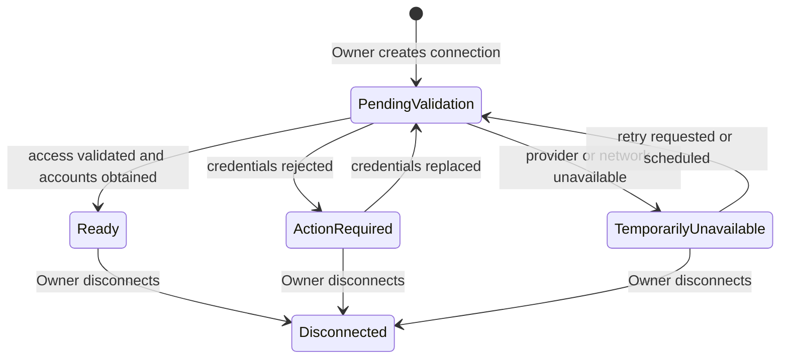

# Broker connections

## Domain distinctions

- A **broker adapter** is an internal Portfolio Service boundary that translates
  provider-specific access, accounts, positions, and errors into neutral
  Portfolio Service concepts.
- A **broker connection** is a tenant-owned technical authorization context for
  reaching a broker through an adapter.
- An **accessible account** is an external account reported through a validated
  connection.
- An **included account** is an accessible account that the Owner explicitly
  selected for the tenant portfolio (`included = true`).

Connection-to-account cardinality is adapter-specific and is not a system-wide
invariant. One provider may expose one account per connection and another may
expose several. The first adapter supports the approved Alpaca paper-account
scope, but broker-specific environment representation is not promoted into a
universal account model without evidence.

## Broker adapter boundary

The neutral adapter contract must support these capabilities at a conceptual
level:

1. validate access represented by a connection;
2. return the account or accounts accessible through that connection;
3. fetch a complete current position set for a selected account;
4. normalize provider positions without leaking provider DTOs;
5. normalize provider errors into stable Portfolio Service categories while
   retaining protected diagnostics internally;
6. expose only capabilities required by the Portfolio Service use case.

The adapter does not persist data, authorize users, select accounts, orchestrate
refresh, calculate freshness, consolidate positions, or publish cross-service
messages.

## Connection creation and validation

Creation is asynchronous:

The synchronous API boundary validates the caller and request shape, encrypts
credentials, persists the connection/operation/audit/outbox atomically, and
returns an operation identifier. It does not wait for the broker.

Meanings:

- `PendingValidation`: validation is queued or running;
- `Ready`: broker access succeeded and accessible accounts are available for
  explicit selection;
- `ActionRequired`: retry without Owner action is not useful, for example when
  credentials are rejected;
- `TemporarilyUnavailable`: retry may succeed without changing credentials;
- `Disconnected`: terminal state; credentials are destroyed and the connection
  cannot be reactivated.

Updating credentials from `ActionRequired` creates a new validation attempt and
returns the connection to `PendingValidation`. Operational retry/timeout limits
are configuration.

The richer reversible disable/reconnect lifecycle is deferred beyond this
slice. To regain access after `Disconnected`, the Owner creates a new connection.

## Account selection and initial import

- Discovery/accessibility and portfolio inclusion are separate.
- Only the Owner may change `included`.
- Inclusion is a boolean rather than an additional account lifecycle.
- Changing `included` from `false` to `true` automatically registers an
  asynchronous initial-import operation and returns its identifier.
- The user is not required to issue a second manual refresh command.
- Changing `included` to `false` immediately removes the account from future
  refresh target sets and both current portfolio views. Existing snapshots and
  audit history remain subject to retention policy.
- Disconnecting a connection destroys its credentials and atomically makes all
  associated accounts `included = false`.

Position data status is independent from inclusion and is defined in
[Portfolio refresh and views](portfolio-refresh-and-views.md).

## Credential handling

Broker credentials are owned only by Portfolio Service and use envelope
encryption:

1. credentials are encrypted with a data-encryption key;
2. that data key is wrapped by a versioned key-encryption key;
3. PostgreSQL stores ciphertext, wrapped data key, and key metadata, never the
   unencrypted key-encryption key;
4. messages carry `connectionId`, not credentials;
5. the worker retrieves and decrypts credentials immediately before an adapter
   call;
6. plaintext exists only in memory for the shortest practical duration;
7. key unavailability prevents the broker call and produces safe stable errors;
8. rotation supports new active key versions and gradual rewrapping.

Local development uses a test key supplied through `.env`. A deployed environment
must use an external centralized key manager through a replaceable key-provider
boundary. The specific KMS/Vault product and cryptographic algorithms remain
open infrastructure and low-level security decisions.

## Errors and user-facing messages

Portfolio Service owns stable namespaced connection and adapter error codes.
An error separates:

- stable code;
- safe structured parameters;
- retryability/action requirement;
- user-friendly text resolved through the service message catalogue;
- protected diagnostics that are never returned to the caller.

The catalogue is a service-local component following a common error envelope,
not a central Error Dictionary Service. Full localization and administrative
message editing are deferred, but the separation is required in the slice.

## Broker connection invariants

- Credentials never appear in a URL, message, log, trace attribute, audit detail,
  exception response, or snapshot.
- Validation success is not account inclusion.
- Account inclusion is not proof that a usable snapshot exists.
- A connection operation is idempotent under message redelivery.
- Duplicate external accounts must not silently create duplicate included
  sources; the precise provider-identity constraint is deferred to contract
  design.
- Portfolio Service never invokes a broker write/trading operation.

