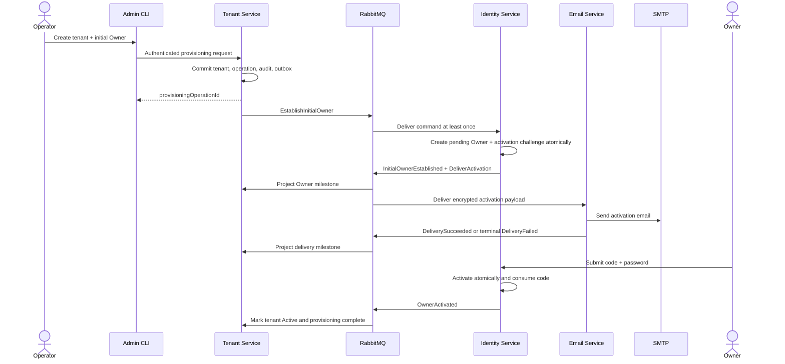
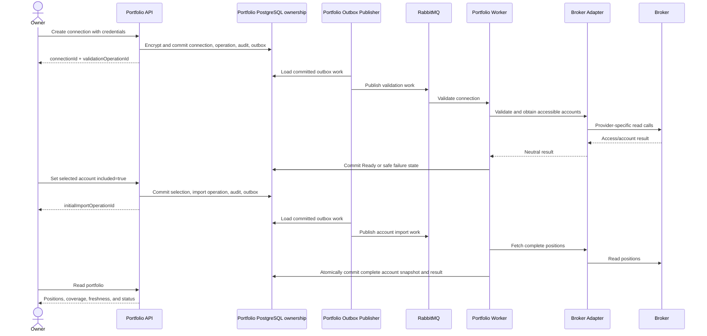
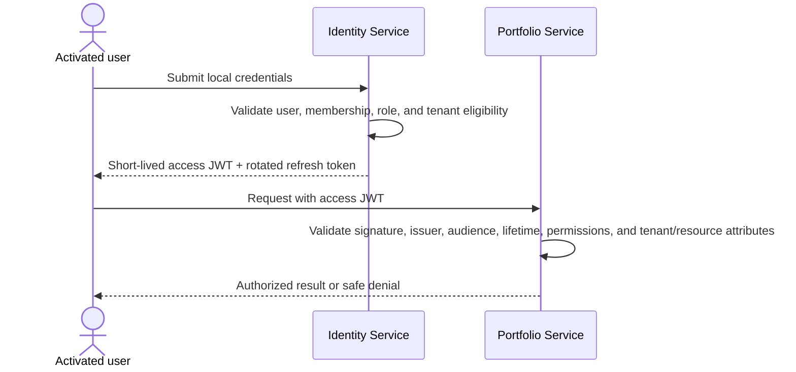

# Cross-service contracts

This document defines contract intent, not URLs, payload schemas, database
tables, or classes.

## Synchronous and asynchronous boundary

A synchronous API response proves only that the owning service has atomically
validated and committed the local acceptance or local state change. It never
claims that a remote service, RabbitMQ consumer, SMTP server, or broker has
already completed later work.

| Conceptual operation | Owner | Synchronous result | Asynchronous continuation |
| --- | --- | --- | --- |
| Create tenant with initial Owner | Tenant | Tenant/provisioning identifiers after local commit | Establish Owner, send activation, project milestones |
| Observe provisioning | Tenant | Current projection and safe errors | None initiated by read |
| Activate initial Owner | Identity | Local activation/password result | Publish Owner-activated fact |
| Sign in / refresh token | Identity | Tokens or safe authentication error | None |
| Create broker connection | Portfolio | Connection/validation operation identifiers after encrypted local commit | Validate connection and obtain accessible accounts |
| Observe connection validation | Portfolio | Current connection/operation state | None initiated by read |
| Select or exclude account | Portfolio | Updated selection and, on inclusion, initial-import identifier | Initial import when changed to included |
| Disconnect broker connection | Portfolio | Terminal disconnect after credentials and inclusion changes commit | Publish resulting facts if needed |
| Request tenant refresh | Portfolio | New or reused operation identifier | Fetch target accounts and aggregate outcomes |
| Observe refresh/import | Portfolio | Current operation, account results, and safe errors | None initiated by read |
| Read portfolio | Portfolio | Account or consolidated view | Never starts refresh |

## Conceptual message catalogue

Names below express meaning only. Final names, versions, and payloads are open
contract-design details.

### Cross-service commands

| Command meaning | Producer | Consumer | Required context |
| --- | --- | --- | --- |
| Establish the initial Owner for a provisioned tenant | Tenant | Identity | Tenant, provisioning operation, initial Owner address/profile, message/correlation/causation, narrow internal authorization |
| Deliver an activation email | Identity | Email | Tenant, delivery and activation references, recipient/template inputs, encrypted activation secret, expiry, correlation context |

Commands have one intended owner/consumer. Consumers validate the internal
JWT issued by Identity Service, its recipient/audience, and its action scope;
RabbitMQ delivery alone grants no authority.

### Cross-service facts

| Fact meaning | Producer | Interested consumers |
| --- | --- | --- |
| Tenant created | Tenant | Identity and future interested services where justified |
| Initial Owner established | Identity | Tenant |
| Initial Owner establishment failed terminally | Identity | Tenant |
| Activation delivery succeeded | Email | Tenant and Identity where delivery projection is required |
| Activation delivery failed terminally | Email | Tenant and Identity where resend/action state is required |
| Initial Owner activated | Identity | Tenant |
| Portfolio refresh finished | Portfolio | No mandatory consumer in this slice; published contract may support later Scheduler/Analysis integration |

Facts describe completed local truth and are not requests for another service to
pretend that truth exists.

### Portfolio-internal queued work and facts

These messages remain within the Portfolio Service ownership boundary even when
RabbitMQ separates API and worker processes:

- validate broker connection;
- validation succeeded or failed;
- execute initial account import;
- execute tenant refresh;
- fetch positions for one account;
- account import succeeded or failed;
- tenant refresh completed, partially completed, or failed.

They follow the same message identity, inbox, outbox, retry, and authorization
rules as cross-service work. They do not create a new service boundary or new
data owner.

## End-to-end sequences

### Provision tenant and activate Owner



### Connect account and import initial positions



### Authenticate and call a protected API



Portfolio does not call Identity synchronously during this request, and the
user bearer token is not forwarded into asynchronous work.

### Manual tenant refresh

```mermaid
sequenceDiagram
    actor User as Owner or Manager
    participant API as Portfolio API
    participant DB as Portfolio PostgreSQL ownership
    participant Publisher as Portfolio Outbox Publisher
    participant MQ as RabbitMQ
    participant W1 as Portfolio Worker instance A
    participant W2 as Portfolio Worker instance B
    participant Broker

    User->>API: Request tenant refresh
    API->>DB: Atomically create or find unfinished/recent operation
    DB-->>API: operationId + created/reused
    API-->>User: Accepted operation
    Publisher->>DB: Load committed outbox work when newly created
    Publisher->>MQ: Publish refresh work
    MQ->>W1: Execute refresh
    W1->>DB: Atomically claim Pending operation
    W2->>DB: Competing/repeated claim
    DB-->>W2: Already claimed; do not execute twice
    par Account work up to configured limit
        W1->>Broker: Fetch account A positions
    and
        W1->>Broker: Fetch account B positions
    end
    W1->>DB: Commit each account snapshot/result independently
    W1->>DB: Commit aggregate terminal outcome and audit/outbox
    User->>API: Observe operation / read portfolio
    API-->>User: Status, per-account results, errors, snapshots, freshness
```

## Message identity and correlation

Every asynchronous envelope carries:

- unique `messageId` for transport deduplication;
- `tenantId` where the work is tenant scoped;
- relevant business `operationId`;
- `correlationId` for the end-to-end request/workflow;
- `causationId` identifying the command/event that produced this message;
- producer, message type, contract version, and occurrence time;
- narrow internal authorization context where the message is a command.

`messageId` and `operationId` are deliberately different. A single operation
may produce many messages, attempts, and facts.

## Local transaction pattern

For each service-owned transition:

1. validate current state and authorization;
2. update service-owned business data;
3. append the service-owned local audit record;
4. add any outgoing message to the service outbox;
5. commit all four in one local transaction.

An outbox publisher retries delivery until RabbitMQ accepts the message. A
consumer validates the message, checks/inserts its inbox identity, applies its
business transition, appends audit, and writes resulting outbox messages in one
local transaction. RabbitMQ is acknowledged only after commit.

No workflow uses a transaction across services, databases roles, RabbitMQ,
SMTP, or a broker API.

## Duplicate, ordering, and stale-message behavior

- The consumer inbox prevents executing the same `messageId` twice.
- Business state transitions also enforce operation-level idempotency so two
  different messages cannot repeat a completed business action.
- Repeating an already accepted create-tenant or create-connection request must
  return/recover the original accepted result rather than create a second
  business resource. The exact request-identity mechanism for the case where
  the first HTTP response was lost remains a contract-design question.
- Consumers reject or harmlessly ignore transitions that are invalid for the
  current state; they do not roll state backward.
- Facts may arrive after the caller has timed out or after a newer read; the
  authoritative service state remains the source of truth.
- Contract versions are explicit. Unsupported versions are not guessed at or
  deserialized into a superficially similar shape.

## Dead-letter and stuck-work policy

- Transient transport/processing failures are retried with configured limits
  and delays.
- After attempts are exhausted, an unprocessable message moves to a dead-letter
  queue.
- The service records a safe audit event, metric, and alert without exposing
  secret payloads.
- A recovery mechanism prevents the associated operation from remaining
  indefinitely `Pending` or `Running`; it records terminal `Failed` state and
  stable errors when safe automated recovery is exhausted.
- Messages are not automatically replayed from the dead-letter queue. An
  operator must correct the cause and explicitly request replay/recovery.

## Failure and recovery catalogue

| Failure | Durable truth | Recovery/observable behavior |
| --- | --- | --- |
| Identity unavailable after tenant commit | Tenant and provisioning operation exist; Owner milestone incomplete | Outbox retries; operation remains observable; terminal exhaustion records failure without duplicating tenant |
| SMTP temporarily unavailable | Pending Owner and activation challenge remain valid | Email retries same encrypted payload; Tenant projects delivery progress |
| Email delivery permanently fails | Tenant remains awaiting activation | Terminal delivery error is visible; authorized resend issues a new code and supersedes the prior one |
| Broker credentials rejected | Encrypted connection remains `ActionRequired` | Owner replaces credentials or disconnects; no blind automatic retry |
| Broker/network temporarily unavailable | Connection or account attempt records retryable errors | Configured retry/backoff, then safe terminal outcome |
| Some accounts fail refresh | Successful snapshots commit; failed accounts retain prior snapshots or remain unavailable | Refresh is `PartiallySucceeded`; portfolio is honest about coverage and freshness |
| All accounts fail refresh | Prior snapshots, if any, remain | Refresh is `Failed`; portfolio may be `Degraded` with stale data or `Unavailable` |
| Worker dies after broker response but before commit | No partial snapshot is visible | Message/work lease is retried; state and inbox prevent duplicate terminal effects |
| Worker commits but dies before RabbitMQ acknowledgement | State is committed and inbox records message | Redelivery is recognized and acknowledged without re-execution |
| Outbox publication delayed | Business transition remains committed with pending outbox | Publisher retries; backlog metric/alert exposes delay |
| Key provider unavailable | Encrypted credentials remain protected | Broker call is not made; safe retryable error is recorded |
| Unknown message version or corrupt payload | No business mutation | Retry policy then DLQ, audit, alert, and operation recovery |
