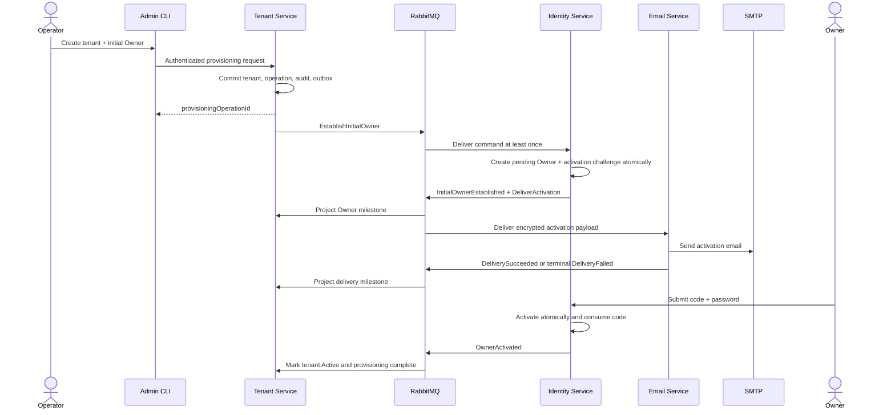
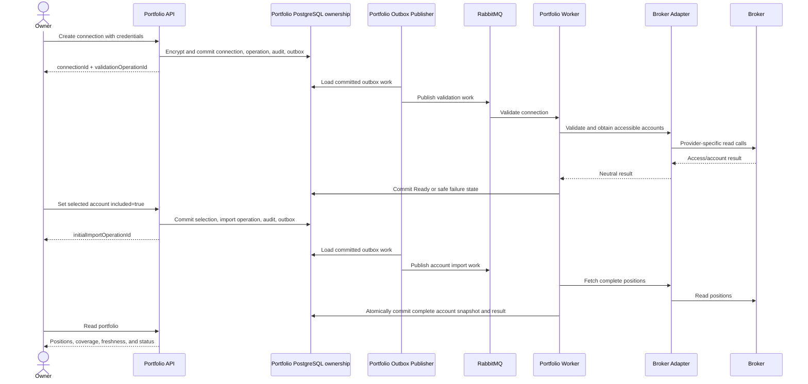
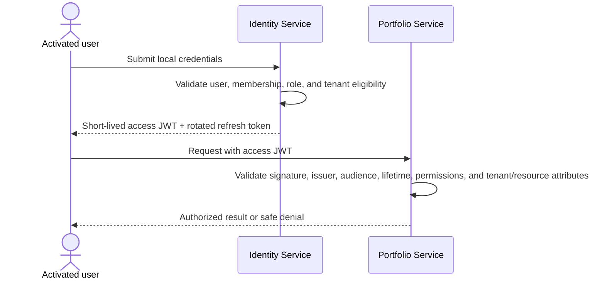

# Cross-service sequences

## End-to-end sequences

### Provision tenant and activate Owner



### Connect account and import initial positions



### Authenticate and call a protected API



Portfolio does not call Identity synchronously during this request, and the
user bearer token is not forwarded into asynchronous work.

### Manual tenant refresh

```mermaid
sequenceDiagram
    actor User as Owner or Manager
    participant API as Portfolio API
    participant DB as Portfolio PostgreSQL ownership
    participant Publisher as Portfolio Outbox Publisher
    participant MQ as RabbitMQ
    participant W1 as Portfolio Worker instance A
    participant W2 as Portfolio Worker instance B
    participant Broker

    User->>API: Request tenant refresh
    API->>DB: Atomically create or find unfinished/recent operation
    DB-->>API: operationId + created/reused
    API-->>User: Accepted operation
    Publisher->>DB: Load committed outbox work when newly created
    Publisher->>MQ: Publish refresh work
    MQ->>W1: Execute refresh
    W1->>DB: Atomically claim Pending operation
    W2->>DB: Competing/repeated claim
    DB-->>W2: Already claimed; do not execute twice
    par Account work up to configured limit
        W1->>Broker: Fetch account A positions
    and
        W1->>Broker: Fetch account B positions
    end
    W1->>DB: Commit each account snapshot/result independently
    W1->>DB: Commit aggregate terminal outcome and audit/outbox
    User->>API: Observe operation / read portfolio
    API-->>User: Status, per-account results, errors, snapshots, freshness
```


[Back to index](index.md)
