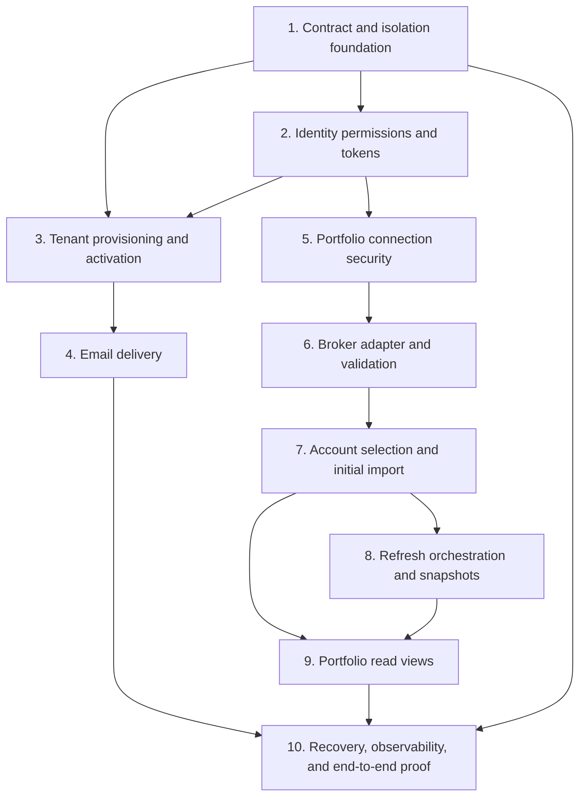

# Implementation and readiness

This document defines a future implementation sequence and completion gates. It
does not authorize implementation as part of the present specification task.

## Dependency-ordered implementation plan

### 1. Contract and isolation foundation

- establish service projects/process boundaries and independent database roles;
- establish tenant context propagation and RLS test harness;
- define common message, error, and audit envelopes without shared persistence;
- establish transactional outbox/inbox behavior and correlation propagation;
- define configuration validation conventions for policy values.

Exit gate: two representative services can commit an outbox message, consume it
idempotently under tenant isolation, and correlate logs/traces without sharing
tables or user tokens.

### 2. Identity permissions and tokens

- implement fixed role-to-permission bundles;
- issue and locally validate short-lived access JWTs;
- rotate/revoke refresh tokens;
- prepare initial-Owner membership and activation capabilities;
- verify Owner/Manager/Viewer authorization through test memberships.

Exit gate: permission and ABAC tests cover allowed, denied, expired, wrong
tenant, wrong audience, changed membership, and refresh-token revocation cases.

### 3. Tenant provisioning and activation

- implement protected Admin CLI to Tenant Service acceptance;
- persist tenant/provisioning/audit/outbox atomically;
- establish pending Owner idempotently through Identity;
- implement activation challenge lifecycle, password setup, and Owner-activated
  fact;
- project all onboarding milestones in Tenant Service.

Exit gate: duplicate/out-of-order messages cannot create duplicate tenants,
memberships, Owners, or active codes, and a failed remote step is observable and
recoverable.

### 4. Email delivery

- implement encrypted activation payload contract;
- implement Email-owned composition, SMTP delivery state, retries, and terminal
  facts;
- verify resend supersedes prior activation code;
- verify delivery failure does not roll back tenant or pending Owner.

Exit gate: activation email can be sent through the configured local/test SMTP
path without exposing the code in logs, audit, or stored plaintext history.

### 5. Portfolio connection security

- implement Portfolio ownership, RLS, permissions, local audit, and error
  catalogue;
- implement envelope-encrypted credentials and key-provider abstraction;
- support dev-only `.env` key and deployed external-provider mode boundary;
- implement create, observe, credential replacement during action-required
  state, and terminal disconnect.

Exit gate: database/message/log/trace inspection reveals no plaintext broker
credential; unavailable keys fail closed.

### 6. Broker adapter and validation

- define neutral validation/account/position/error contract;
- adapt the relevant prior Alpaca normalization behavior only after review;
- implement asynchronous connection-validation operation;
- persist accessible accounts without assuming universal cardinality.

Exit gate: valid, rejected, temporarily unavailable, repeated, and malformed
provider outcomes produce the correct connection states and stable errors.

### 7. Account selection and initial import

- implement explicit `included` selection;
- automatically create initial-import work on inclusion;
- guarantee one in-flight fetch per account;
- atomically commit complete empty or nonempty snapshots;
- preserve prior snapshots on failed work.

Exit gate: selecting a real Alpaca paper account eventually makes its real
positions visible, and selecting an empty account yields a valid empty snapshot.

### 8. Refresh orchestration and snapshots

- implement database-coordinated create-or-find across Portfolio instances;
- capture target account set at acceptance;
- apply unfinished/recent-operation reuse policy;
- run account work with bounded parallelism and transient retry;
- aggregate success/partial/failure with per-account error lists;
- recover expired claims and terminate exhausted work safely.

Exit gate: concurrency, redelivery, process death, partial provider failure, and
all-account failure tests preserve invariants and never erase successful data.

### 9. Portfolio read views

- implement `NotConfigured`, `Ready`, `Degraded`, and `Unavailable` calculation;
- expose account and consolidated views over the same snapshots;
- disclose coverage, per-account freshness, mixed snapshot times, active refresh,
  and safe errors;
- preserve currency per position without FX or cross-currency totals.

Exit gate: every accepted view is reproducible from committed snapshots and
cannot misrepresent stale/missing coverage as current or complete.

### 10. Recovery, observability, and end-to-end proof

- implement DLQ/operator recovery path and stuck-operation reconciliation;
- complete required audit events, structured logs, traces, metrics, health, and
  local alert demonstrations;
- execute the complete local user journey and documented failure drills.

Exit gate: all readiness criteria below pass and the evidence is captured for
the project documentation.

## Verification strategy

### Contract and unit verification

- lifecycle transitions and invalid-transition rejection;
- permission bundles and resource/tenant rules;
- error-code-to-message fallback behavior;
- refresh outcome and portfolio status derivation;
- consolidation identity/currency rules;
- retryability classification and configuration validation.

### Database integration verification

- RLS isolation with real PostgreSQL roles;
- service ownership restrictions and forbidden cross-service access;
- atomic business/audit/outbox and inbox/business/outbox transactions;
- multi-instance refresh create-or-find race;
- account snapshot atomic replacement and empty-snapshot behavior;
- worker claim expiry/recovery and operation terminalization.

### Messaging integration verification

- duplicate, delayed, out-of-order, and unsupported-version messages;
- repeated create-tenant and create-connection calls after a lost response;
- publish failure after local commit;
- consumer crash before and after commit;
- internal JWT audience/scope rejection;
- poison-message DLQ and explicit replay process;
- end-to-end correlation preservation.

### Security verification

- no secrets in logs, traces, audits, errors, messages, or database plaintext;
- envelope-encryption round trip, rotation, and unavailable-key behavior;
- activation encrypt-only/decrypt-only permission separation;
- expired, reused, superseded, and over-attempt activation codes;
- expired/wrong-audience/wrong-tenant JWTs;
- Owner/Manager/Viewer permissions and cross-tenant denial.

### End-to-end verification

At minimum, one local end-to-end run must demonstrate:

1. operator creates tenant and initial Owner;
2. activation email is delivered through the configured SMTP path;
3. Owner activates, sets a password, signs in, and obtains valid tokens;
4. Owner creates a connection and observes successful asynchronous validation;
5. Owner includes at least one real Alpaca paper account;
6. automatic initial import completes;
7. Owner reads real positions in account and consolidated views;
8. Owner or Manager launches a manual refresh and observes operation progress;
9. the resulting portfolio exposes status, coverage, currency, and freshness;
10. Viewer can read but cannot refresh or manage connections.

The decisive user outcome is step 7, not merely successful email activation.

## Architecture readiness criteria

- Every service-owned datum and state transition has one authoritative owner.
- Cross-service references and dependencies obey the ownership rules.
- Every synchronous response and asynchronous message has defined semantics.
- Lifecycle diagrams cover success, partial success, retries, terminal failure,
  and recovery.
- Tenant and account concurrency invariants hold across multiple instances.
- Transaction boundaries, outbox/inbox behavior, correlation, and DLQ handling
  are specified and verified.
- Credential and activation-secret protection has no unresolved plaintext path.
- Permissions are independent from roles and enforced by every API.
- Local audit and observability cover every long-running operation.
- Approved decisions and unresolved questions remain separate.
- No intention document has been treated as an approved dependency.

## Functional readiness criteria

- The complete end-to-end verification passes with a real Alpaca paper account.
- Both required portfolio views show correct current positions.
- Manual refresh is accepted asynchronously and observable to completion.
- Concurrent/repeated refresh requests follow the accepted reuse policy.
- Partial failure retains successful and prior usable account snapshots.
- `NotConfigured`, `Ready`, `Degraded`, and `Unavailable` are demonstrated.
- Empty successful accounts and unavailable never-imported accounts are
  distinguishable.
- Currency is shown per position and never misleadingly aggregated.
- Safe error lists can be resolved through each service's message catalogue.

## Security and operational readiness criteria

- The environment is explicitly local/dev and not publicly exposed.
- RLS and cross-tenant tests pass.
- The dev key provider is visibly non-production and deployed mode cannot use it.
- No credential, token, activation code, or private key appears in telemetry or
  persistent plaintext.
- Audit records exist for required security and business actions.
- Required metrics, traces, health checks, backlog/stuck-work signals, and DLQ
  behavior are demonstrable.
- Configuration values have validation and documented safe defaults.

## Not a completion claim for the product MVP

Passing this slice proves the Portfolio Foundation only. It does not prove the
MVP product promise, which additionally requires strategy-aware portfolio
attention analysis, opportunity search, scheduling, persisted results, and
completed-analysis email delivery.
