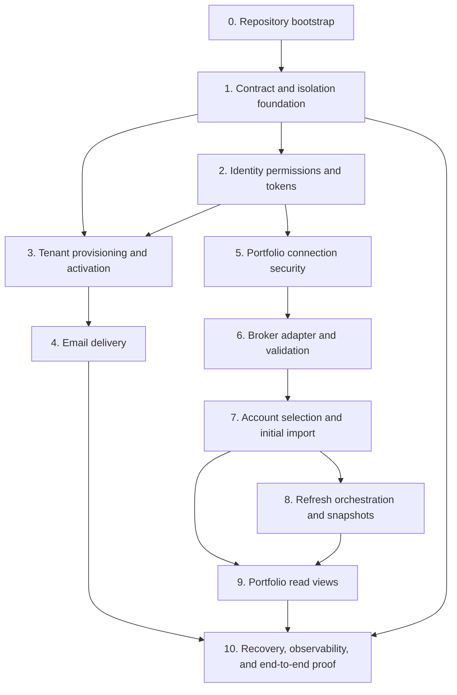

# Implementation and readiness

This document defines the implementation sequence and completion gates.
Implementation proceeds only within the scope authorized by the project owner.

## Bootstrap checkpoint (2026-10-05)

Milestone 0 is in progress, not complete.

- The owner installed .NET SDK 10.0.401 and pinned it in `global.json` with
  roll-forward disabled.
- All 13 planned projects and solution folders exist in `InvestorAI.slnx`.
  Common properties are in `Directory.Build.props`; current NuGet versions
  are centralized in `Directory.Packages.props`.
- Restore and build passed. Two analyzer warnings remain in the template
  Email Worker logging code.
- The owner started PostgreSQL `18.6-bookworm` and RabbitMQ
  `4.3.6-management` with Compose. Both reported healthy; published ports
  bind to localhost.
- The owner added containerized pgAdmin as a local database client and
  verified a connection to `investorai` as `investorai_admin`, running
  PostgreSQL 18.6.

### RabbitMQ scope at this checkpoint

RabbitMQ does not use PostgreSQL/DbUp SQL migrations. No further RabbitMQ
topology setup is needed for the current bootstrap step. Exchanges, queues,
bindings, permissions, and policies will be defined when concrete cross-service
message contracts are implemented in milestone 1. This checkpoint does not
claim that future messaging setup or verification is complete.

### PostgreSQL role bootstrap (2026-10-06)

The approved bootstrap is implemented in
[`infra/postgres/bootstrap.ps1`](../../../infra/postgres/bootstrap.ps1) and
[`001_bootstrap.sql`](../../../infra/postgres/sql/001_bootstrap.sql).
Visual Studio groups these files under `SolutionItems/Postgres` and its `SQL`
subfolder without moving their physical locations.

The bootstrap uses the existing database and the standard `public` schema.
Tenant, Identity, Email, and Portfolio each have two LOGIN roles named
`investorai_<service>_migration` and `investorai_<service>_runtime`. New roles
have no superuser, database/role creation, replication, or RLS-bypass authority.
All receive CONNECT and schema USAGE; only migration roles receive schema
CREATE. PUBLIC loses database CREATE/TEMPORARY and schema CREATE. Migration
roles own the objects they create. Service-owned DbUp migrations will grant
runtime access to specific objects; bootstrap grants no blanket table access.

Existing roles are skipped without checking or repairing their settings,
memberships, or passwords. Initial grants are reapplied. Restricted-role
guarantees therefore apply to newly created roles, not arbitrary pre-existing
roles. Role password rotation requires a separate deliberate change.

Each numbered `NNN_*.sql` file must tolerate repeated execution and contain
its own BEGIN/COMMIT. The runner executes files by name, stops at the first
error, and maintains no journal. A failed file rolls back; previously committed
files remain applied. Add future files to `SolutionItems/Postgres/SQL` explicitly.

#### Local run command

Requires PowerShell 7+, Docker Compose, and an already running PostgreSQL
service from this repository's Compose project. The configured administrator
must be a superuser (the initial POSTGRES_USER created by this Compose image).
The runner disables statement/error-statement logging for its administrator
session before handling role passwords and suppresses raw client diagnostics.

Keep the root `.env`; add missing keys from [`.env.example`](../../../.env.example).
Set POSTGRES_DB, POSTGRES_USER, POSTGRES_PASSWORD and separate
`<SERVICE>_MIGRATION_PASSWORD` / `<SERVICE>_RUNTIME_PASSWORD` values for TENANT,
IDENTITY, EMAIL, and PORTFOLIO. Values are literal single lines; optional outer
quotes are removed, with no evaluation, variable expansion, or escape processing.
Passwords travel through stdin, not command arguments. Compose interpolation
uses placeholders for container selection rather than interpreting real secrets.

From the repository root:

```powershell
docker compose up -d
.\infra\postgres\bootstrap.ps1
```

If using Windows PowerShell, invoke the script with `pwsh -NoProfile -File`.
There is no AdminCli database bootstrap command. This script does not start
containers, create the database, or configure DbUp.

#### Verification evidence

On 2026-10-06, an isolated PostgreSQL `18.6-bookworm` Compose fixture passed:

- eight new roles with the expected attributes, no role memberships, and correct
  database/schema permissions;
- repeated bootstrap with different supplied passwords preserves stored passwords;
- TCP authentication with a literal password containing quotes, backslash,
  dollar sign, backtick, hash, equals sign, spaces, and Unicode;
- migration table creation/removal, runtime permanent/temporary DDL denial,
  runtime DML after explicit grants, and denial for a neighboring service;
- existing role settings are deliberately left unchanged;
- per-file rollback, previous-file commit preservation, stop after failure,
  corrected-file recovery, and repeated execution of multiple numbered files;
- missing configuration rejection and no role secrets in runner output or
  PostgreSQL logs.

The temporary test Compose project was removed after verification. The isolated
checks did not change the owner's working database, `.env`, or working volumes.
This proves bootstrap behavior, not application RLS, service DbUp setup, or
complete milestone 0 readiness.

#### Owner environment verification (2026-10-06)

The owner populated the eight service-role passwords in the local `.env`,
started the full environment with `docker compose up -d`, and ran
`.\infra\postgres\bootstrap.ps1` against the working `investorai` database.
The output confirmed `Applied 001_bootstrap.sql.` and
`PostgreSQL bootstrap completed.` The owner subsequently confirmed that the
repeat-run check works.

The owner also inspected the roles in pgAdmin. The supplied query result shows
all eight service roles with LOGIN and schema USAGE; schema CREATE is true only
for migration roles. SUPERUSER, CREATEDB, CREATEROLE, BYPASSRLS, and database
TEMPORARY are false for all eight. This is working-environment evidence for
these attributes and privileges; actual DDL/DML denial and password preservation
were exercised separately in the isolated fixture above.

To repeat this read-only inspection in pgAdmin, select the `investorai` database
and open Query Tool as the configured administrator:

```sql
SELECT
    rolname,
    rolcanlogin,
    rolsuper,
    rolcreatedb,
    rolcreaterole,
    rolbypassrls,
    has_schema_privilege(rolname, 'public', 'USAGE') AS schema_usage,
    has_schema_privilege(rolname, 'public', 'CREATE') AS schema_create,
    has_database_privilege(
        rolname, current_database(), 'TEMPORARY'
    ) AS temporary_tables
FROM pg_roles
WHERE rolname IN (
    'investorai_tenant_migration', 'investorai_tenant_runtime',
    'investorai_identity_migration', 'investorai_identity_runtime',
    'investorai_email_migration', 'investorai_email_runtime',
    'investorai_portfolio_migration', 'investorai_portfolio_runtime'
)
ORDER BY rolname;
```

### Tenant DbUp migrator (2026-10-06)

The Tenant migrator implements a one-shot console process with ServiceCollection
DI and no Generic Host. Its common infrastructure is now in
`src/BuildingBlocks/InvestorAI.DatabaseMigrations`. Application services receive constructor dependencies;
the solution-wide rule is in
[implementation conventions](../../architecture/implementation-conventions.md).
Only Tenant is implemented; the other three migrators remain templates.

Configuration priority is `appsettings.json`, then root `.env` in Development
only, then process environment. `Database__Host`, `Database__Port`,
`Database__Name`, and `Database__Password` override their corresponding process
aliases POSTGRES_HOST, POSTGRES_PORT, POSTGRES_DB, and TENANT_MIGRATION_PASSWORD.
Appsettings contains ordinary settings only: host `localhost`, port `5432`,
and database name `investorai`. These defaults can be overridden by dotenv or
process environment. No password is stored in JSON. Appsettings is copied to build/publish
output. `.env` and secrets are not copied. Username is fixed to
`investorai_tenant_migration`; administrator and runtime credentials are unused.

The F5 profile selects DOTNET_ENVIRONMENT=Development. The root is located by
walking upwards from AppContext.BaseDirectory to InvestorAI.slnx; the root
`.env` must exist. The parser uses the bootstrap's literal-value rules without
expansion or escape processing. Development defaults a blank host to localhost.
Production (also the default when the environment is absent) does not search
for `.env` or a repository; it also receives the JSON defaults. Container
configuration must override host when PostgreSQL runs in another container.
An explicitly blank Production host is rejected. Port defaults to 5432 and must be
1-65535. Database name and migration password are required. Unknown environment
names fail. Connection strings use NpgsqlConnectionStringBuilder.

Embedded SQL names are stable `Tenant.Migrations.<filename>`, ordered ordinally.
The first script, `001_verify_migrator.sql`, executes SELECT 1 without business
tables. DbUp records it in `public.tenant_schema_migrations`. Migration files
are RunOnce, must not be renamed/edited once applied, and have one DbUp-managed
transaction per file. Unlike infrastructure SQL, these files contain no explicit
BEGIN/COMMIT. No runtime or neighboring service receives journal privileges.

Success, including no pending migrations, exits 0. Failure exits 1 and stops
later scripts. Output is limited to script names, outcomes, safe validation
messages, and SQLSTATE where available; raw DbUp diagnostics are suppressed.
No database creation, bootstrap invocation, retries, or application startup is
performed. Run only one Tenant migrator instance at a time at this stage.

#### Owner run commands

In Visual Studio, select InvestorAI.Tenant.DatabaseMigrator as the startup
project and use its Development profile, then press F5. PostgreSQL and the role
bootstrap must already be ready. From the repository root, the equivalent is:

```powershell
dotnet run --project src/Tenant/InvestorAI.Tenant.DatabaseMigrator
```

Inspect the journal in pgAdmin, then repeat the run; the row count stays one:

```sql
SELECT * FROM public.tenant_schema_migrations;
```

Published execution without launch settings uses Production and environment
configuration. Container packaging and Compose wiring are a later step.
This implementation does not claim production deployment readiness.

#### Tenant verification evidence (2026-10-06)

Restore/build of the solution and Tenant publish passed. An isolated PostgreSQL
18.6 fixture, with a temporary localhost port and tmpfs storage, verified:

- DI resolution, Options validation, embedded resources, appsettings publication,
  and absence of dotenv in publish output;
- first-run journaling, repeat-run skipping, migration-role ownership, and no
  journal privileges for runtime/neighboring service roles;
- literal special-character/Unicode password authentication;
- JSON, dotenv, legacy process aliases, and standard Database__ variable
  precedence; Development lookup from an unrelated working directory;
- Production execution without a repository/dotenv, ignoring a malformed
  dotenv, and Production as the default environment;
- rejection of missing configuration, unknown environment, missing Development
  root/dotenv, malformed dotenv with a safe line number, and invalid ports;
- safe exit 1 for incorrect credentials and an unavailable database;
- a test-only failing embedded migration rolls back its DDL and journal entry,
  retains the earlier migration, and prevents the following script from running;
- correction/retry resumes the remaining scripts; an empty embedded-script
  assembly is rejected.

The failing and empty-script builds existed only in a temporary test fixture.
The dedicated test container was removed. The owner's `.env`, database and
working volumes were not changed. The fixture verifies the corresponding
Development path separately from the owner's Visual Studio verification below.
Milestone 0 remains incomplete.

#### Owner Tenant verification (2026-10-07)

The owner completed the step-by-step F5/pgAdmin checks in the working environment:

- First F5 run reported `Applied Tenant.Migrations.001_verify_migrator.sql.`,
  followed by `Tenant database migrations completed.`, and exited with code 0.
- pgAdmin showed exactly one journal row for the first embedded migration.
- The second F5 run reported completion without an Applied line and exited 0.
  The journal retained the same single row and applied timestamp.
- The journal owner is `investorai_tenant_migration`.
- All seven other service roles have no SELECT, INSERT, UPDATE, or DELETE
  privilege on `public.tenant_schema_migrations`.

These results confirm working-environment execution, journaling, repeat-run
skipping, ownership, and journal access isolation. Failure rollback remains
verified by the separate test fixture; no failing migration was applied to the
owner's database.

### Shared migration infrastructure (2026-10-07)

The reusable configuration, dotenv reading, connection settings, DbUp execution,
safe output, and common DI registration are extracted into
`InvestorAI.DatabaseMigrations` under BuildingBlocks. Tenant references this
project. The other three service migrators are still unimplemented templates.

`MigrationDefinition` carries service-owned metadata: service name, migration
username, password environment key, journal schema/table, SQL assembly, and
resource prefix. The shared code contains no Tenant-specific username, password
key, journal name, resource prefix, or SQL scripts. DI creates the common
services and supplies the definition as an immutable value object.

Tenant retains Program.cs, its AddTenantMigrator registration, appsettings,
launch profile, and embedded SQL. Its definition points at the Tenant executable
assembly, not the shared library. Resource names remain `Tenant.Migrations.*`,
the journal remains `public.tenant_schema_migrations`, and configuration priority,
per-script transactions, output, exit codes, and connection application name
are preserved. Existing journal entries therefore continue to match.

The shared project is justified by the approved additional migrator consumers.
It owns migration mechanics only, not business schemas or cross-service data.

### Next step

Tenant's owner F5/pgAdmin verification before extraction is complete. Connect
Identity, Email, and Portfolio to the extracted library. Each migrator retains
its DI registration, migration username, password configuration key, journal
name, and SQL resources.
Verify first/repeat runs, journal ownership, and journal access for each service.
xUnit/test setup and the remaining milestone runbook commands are outstanding.

The owner performs the setup in Visual Studio; the assistant guides and reviews.
Discuss concrete changes before making them and obtain the owner's agreement;
do not automatically implement subsequent steps. The owner explicitly authorized
assistant implementation and isolated verification of this role bootstrap.
XML indentation uses tabs
with display width four; YAML indentation uses spaces.

Role bootstrap is implemented and verified. Remaining milestone gates include
service-owned migrator setup and runtime permission verification on actual
service objects, xUnit/test setup, and remaining repeatable runbook commands.

## Implementation discipline

Use the simplest correct implementation that preserves the approved service,
security, tenancy, and consistency boundaries. A separate project or abstraction
is introduced only when there is a second concrete implementation, a real need
to isolate a dependency, or an already approved invariant that requires a
compile-time boundary. Folder and namespace boundaries are sufficient until
one of those conditions exists.

The bootstrap decisions below do not settle the open API, message, database, or
security contracts recorded in
[Decisions and open questions](decisions-and-open-questions.md).

## Dependency-ordered implementation plan


```mermaid
flowchart TD
    Z[0. Repository bootstrap]
    A[1. Contract and isolation foundation]
    B[2. Identity permissions and tokens]
    C[3. Tenant provisioning and activation]
    D[4. Email delivery]
    E[5. Portfolio connection security]
    F[6. Broker adapter and validation]
    G[7. Account selection and initial import]
    H[8. Refresh orchestration and snapshots]
    I[9. Portfolio read views]
    J[10. Recovery, observability, and end-to-end proof]

    Z --> A
    A --> B
    A --> C
    B --> C
    C --> D
    B --> E
    E --> F
    F --> G
    G --> H
    G --> I
    H --> I
    D --> J
    I --> J
    A --> J
```

### 0. Repository bootstrap

The project owner executes this milestone from a step-by-step runbook. It
creates a reproducible repository foundation without implementing business
behavior or pretending that unresolved contracts are settled.

Initial solution shape:

```text
src/
  Tenant/
    InvestorAI.Tenant.Service
    InvestorAI.Tenant.DatabaseMigrator
  Identity/
    InvestorAI.Identity.Service
    InvestorAI.Identity.DatabaseMigrator
  Email/
    InvestorAI.Email.Worker
    InvestorAI.Email.DatabaseMigrator
  Portfolio/
    InvestorAI.Portfolio.Service
    InvestorAI.Portfolio.DatabaseMigrator
    InvestorAI.Portfolio.Providers.Alpaca
  BuildingBlocks/
    InvestorAI.Observability
    InvestorAI.Messaging
tools/
  InvestorAI.AdminCli
  InvestorAI.DevCli
```

Bootstrap work:

- pin .NET 10 through `global.json` and create `InvestorAI.slnx`;
- centralize common SDK project properties in `Directory.Build.props` and NuGet
  versions in `Directory.Packages.props`;
- enable nullable reference types and the agreed moderate analyzer policy;
- create only the projects shown above, without separate Domain, Application,
  or generic Infrastructure projects;
- prepare one-shot service-owned migrators using Dapper, Npgsql, DbUp, embedded
  SQL resources, separate journals, and distinct migration/runtime role
  configuration;
- add Docker Compose services for PostgreSQL 18 and RabbitMQ 4.3 only, using
  supported pinned patch tags and localhost-safe port exposure;
- establish xUnit as the test framework and reserve Testcontainers for tests
  that make PostgreSQL or RabbitMQ correctness claims;
- document repeatable restore, build, test, Compose start, health-check, and
  cleanup commands.

Bootstrap explicitly excludes business entities and workflows, database
schemas beyond the minimum needed to prove the migrator boundary, a universal
message bus, Mailpit, CI/CD, and speculative framework abstractions. Mailpit is
introduced with activation/email delivery, and CI/CD becomes a gate only after
a meaningful test suite exists.

Exit gate: the documented commands restore and build the full solution, run the
current test command successfully, start healthy PostgreSQL and RabbitMQ
containers, and demonstrate that runtime service credentials cannot perform
DDL. No source or runtime dependency points to `D:\Projects\InvestorAi`.

### 1. Contract and isolation foundation

- establish service projects/process boundaries and independent database roles;
- establish tenant context propagation and RLS test harness;
- define common message, error, and audit envelopes without shared persistence;
- establish transactional outbox/inbox behavior and correlation propagation;
- define configuration validation conventions for policy values.

Exit gate: two representative services can commit an outbox message, consume it
idempotently under tenant isolation, and correlate logs/traces without sharing
tables or user tokens.

### 2. Identity permissions and tokens

- implement fixed role-to-permission bundles;
- issue and locally validate short-lived access JWTs;
- rotate/revoke refresh tokens;
- prepare initial-Owner membership and activation capabilities;
- verify Owner/Manager/Viewer authorization through test memberships.

Exit gate: permission and ABAC tests cover allowed, denied, expired, wrong
tenant, wrong audience, changed membership, and refresh-token revocation cases.

### 3. Tenant provisioning and activation

- implement protected Admin CLI to Tenant Service acceptance;
- persist tenant/provisioning/audit/outbox atomically;
- establish pending Owner idempotently through Identity;
- implement activation challenge lifecycle, password setup, and Owner-activated
  fact;
- project all onboarding milestones in Tenant Service.

Exit gate: duplicate/out-of-order messages cannot create duplicate tenants,
memberships, Owners, or active codes, and a failed remote step is observable and
recoverable.

### 4. Email delivery

- implement encrypted activation payload contract;
- implement Email-owned composition, SMTP delivery state, retries, and terminal
  facts;
- verify resend supersedes prior activation code;
- verify delivery failure does not roll back tenant or pending Owner.

Exit gate: activation email can be sent through the configured local/test SMTP
path without exposing the code in logs, audit, or stored plaintext history.

### 5. Portfolio connection security

- implement Portfolio ownership, RLS, permissions, local audit, and error
  catalogue;
- implement envelope-encrypted credentials and key-provider abstraction;
- support dev-only `.env` key and deployed external-provider mode boundary;
- implement create, observe, credential replacement during action-required
  state, and terminal disconnect.

Exit gate: database/message/log/trace inspection reveals no plaintext broker
credential; unavailable keys fail closed.

### 6. Broker adapter and validation

- define neutral validation/account/position/error contract;
- adapt the relevant prior Alpaca normalization behavior only after review;
- implement asynchronous connection-validation operation;
- persist accessible accounts without assuming universal cardinality.

Exit gate: valid, rejected, temporarily unavailable, repeated, and malformed
provider outcomes produce the correct connection states and stable errors.

### 7. Account selection and initial import

- implement explicit `included` selection;
- automatically create initial-import work on inclusion;
- guarantee one in-flight fetch per account;
- atomically commit complete empty or nonempty snapshots;
- preserve prior snapshots on failed work.

Exit gate: selecting a real Alpaca paper account eventually makes its real
positions visible, and selecting an empty account yields a valid empty snapshot.

### 8. Refresh orchestration and snapshots

- implement database-coordinated create-or-find across Portfolio instances;
- capture target account set at acceptance;
- apply unfinished/recent-operation reuse policy;
- run account work with bounded parallelism and transient retry;
- aggregate success/partial/failure with per-account error lists;
- recover expired claims and terminate exhausted work safely.

Exit gate: concurrency, redelivery, process death, partial provider failure, and
all-account failure tests preserve invariants and never erase successful data.

### 9. Portfolio read views

- implement `NotConfigured`, `Ready`, `Degraded`, and `Unavailable` calculation;
- expose account and consolidated views over the same snapshots;
- disclose coverage, per-account freshness, mixed snapshot times, active refresh,
  and safe errors;
- preserve currency per position without FX or cross-currency totals.

Exit gate: every accepted view is reproducible from committed snapshots and
cannot misrepresent stale/missing coverage as current or complete.

### 10. Recovery, observability, and end-to-end proof

- implement DLQ/operator recovery path and stuck-operation reconciliation;
- complete required audit events, structured logs, traces, metrics, health, and
  local alert demonstrations;
- execute the complete local user journey and documented failure drills.

Exit gate: all readiness criteria below pass and the evidence is captured for
the project documentation.

## Verification strategy

### Contract and unit verification

- lifecycle transitions and invalid-transition rejection;
- permission bundles and resource/tenant rules;
- error-code-to-message fallback behavior;
- refresh outcome and portfolio status derivation;
- consolidation identity/currency rules;
- retryability classification and configuration validation.

### Database integration verification

- RLS isolation with real PostgreSQL roles;
- service ownership restrictions and forbidden cross-service access;
- atomic business/audit/outbox and inbox/business/outbox transactions;
- multi-instance refresh create-or-find race;
- account snapshot atomic replacement and empty-snapshot behavior;
- worker claim expiry/recovery and operation terminalization.

### Messaging integration verification

- duplicate, delayed, out-of-order, and unsupported-version messages;
- repeated create-tenant and create-connection calls after a lost response;
- publish failure after local commit;
- consumer crash before and after commit;
- internal JWT audience/scope rejection;
- poison-message DLQ and explicit replay process;
- end-to-end correlation preservation.

### Security verification

- no secrets in logs, traces, audits, errors, messages, or database plaintext;
- envelope-encryption round trip, rotation, and unavailable-key behavior;
- activation encrypt-only/decrypt-only permission separation;
- expired, reused, superseded, and over-attempt activation codes;
- expired/wrong-audience/wrong-tenant JWTs;
- Owner/Manager/Viewer permissions and cross-tenant denial.

### End-to-end verification

At minimum, one local end-to-end run must demonstrate:

1. operator creates tenant and initial Owner;
2. activation email is delivered through the configured SMTP path;
3. Owner activates, sets a password, signs in, and obtains valid tokens;
4. Owner creates a connection and observes successful asynchronous validation;
5. Owner includes at least one real Alpaca paper account;
6. automatic initial import completes;
7. Owner reads real positions in account and consolidated views;
8. Owner or Manager launches a manual refresh and observes operation progress;
9. the resulting portfolio exposes status, coverage, currency, and freshness;
10. Viewer can read but cannot refresh or manage connections.

The decisive user outcome is step 7, not merely successful email activation.

## Architecture readiness criteria

- Every service-owned datum and state transition has one authoritative owner.
- Cross-service references and dependencies obey the ownership rules.
- Every synchronous response and asynchronous message has defined semantics.
- Lifecycle diagrams cover success, partial success, retries, terminal failure,
  and recovery.
- Tenant and account concurrency invariants hold across multiple instances.
- Transaction boundaries, outbox/inbox behavior, correlation, and DLQ handling
  are specified and verified.
- Credential and activation-secret protection has no unresolved plaintext path.
- Permissions are independent from roles and enforced by every API.
- Local audit and observability cover every long-running operation.
- Approved decisions and unresolved questions remain separate.
- No intention document has been treated as an approved dependency.

## Functional readiness criteria

- The complete end-to-end verification passes with a real Alpaca paper account.
- Both required portfolio views show correct current positions.
- Manual refresh is accepted asynchronously and observable to completion.
- Concurrent/repeated refresh requests follow the accepted reuse policy.
- Partial failure retains successful and prior usable account snapshots.
- `NotConfigured`, `Ready`, `Degraded`, and `Unavailable` are demonstrated.
- Empty successful accounts and unavailable never-imported accounts are
  distinguishable.
- Currency is shown per position and never misleadingly aggregated.
- Safe error lists can be resolved through each service's message catalogue.

## Security and operational readiness criteria

- The environment is explicitly local/dev and not publicly exposed.
- RLS and cross-tenant tests pass.
- The dev key provider is visibly non-production and deployed mode cannot use it.
- No credential, token, activation code, or private key appears in telemetry or
  persistent plaintext.
- Audit records exist for required security and business actions.
- Required metrics, traces, health checks, backlog/stuck-work signals, and DLQ
  behavior are demonstrable.
- Configuration values have validation and documented safe defaults.

## Not a completion claim for the product MVP

Passing this slice proves the Portfolio Foundation only. It does not prove the
MVP product promise, which additionally requires strategy-aware portfolio
attention analysis, opportunity search, scheduling, persisted results, and
completed-analysis email delivery.
