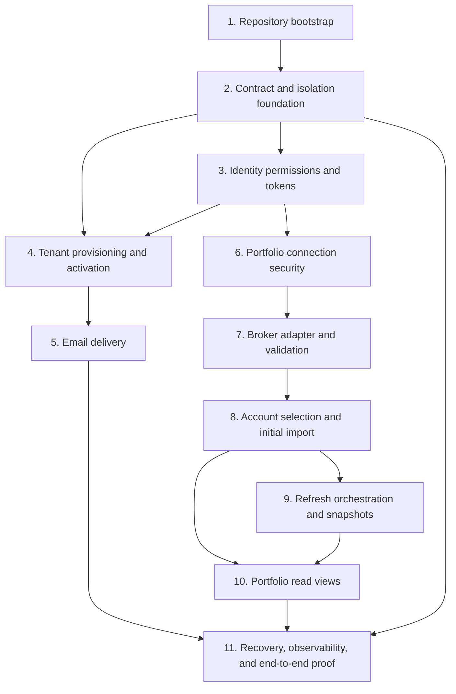

# Implementation plan

Milestone 1 is complete. Milestone 2 is next; later milestones remain planned.

## Dependency-ordered implementation plan

- [1. Repository bootstrap](1-repository-bootstrap.md)
- [2. Contract and isolation foundation](2-contract-and-isolation-foundation.md)
- [3. Identity permissions and tokens](3-identity-permissions-and-tokens.md)
- [4. Tenant provisioning and activation](4-tenant-provisioning-and-activation.md)
- [5. Email delivery](5-email-delivery.md)
- [6. Portfolio connection security](6-portfolio-connection-security.md)
- [7. Broker adapter and validation](7-broker-adapter-and-validation.md)
- [8. Account selection and initial import](8-account-selection-and-initial-import.md)
- [9. Refresh orchestration and snapshots](9-refresh-orchestration-and-snapshots.md)
- [10. Portfolio read views](10-portfolio-read-views.md)
- [11. Recovery, observability, and end-to-end proof](11-recovery-observability-and-end-to-end-proof.md)

[Back to implementation index](../index.md)
