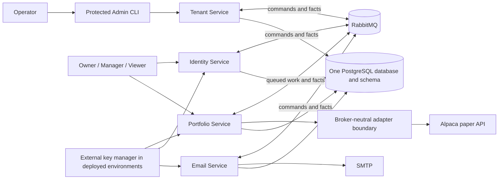
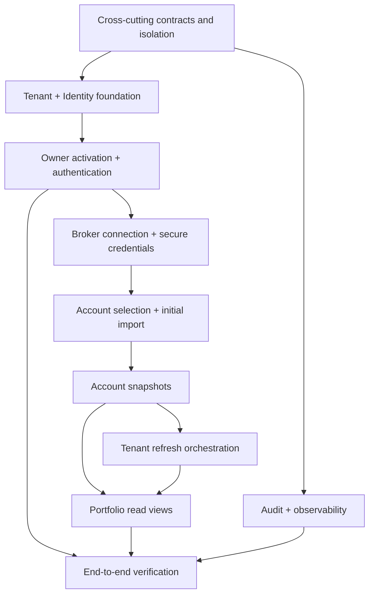

# Portfolio Foundation vertical slice

## Status and authority

This bundle is the detailed architecture specification for the first vertical
slice identified in [MVP architecture](../../architecture/mvp-architecture.md).
It refines that approved architecture without changing the product boundary.
Until this bundle is reviewed and promoted, approved parent documents take
precedence over any accidental conflict.

Documents marked `status: intention`, including the future
[Laya and Jev Decision Layer cascade](../../architecture/decision-layer-laya-jev-cascade-intention.md),
are not inputs to the slice and are not approved dependencies.

## Outcome

The slice is complete when an operator can provision a tenant and initial
Owner, the Owner can activate and authenticate, connect and select one or more
Alpaca paper accounts, and see real imported positions in both account-level
and consolidated portfolio views. The Owner or Manager can request a manual
refresh and observe its progress and outcome. Every view discloses freshness,
coverage, degradation, and any safe user-facing errors.

Activation email or successful authentication alone does not demonstrate slice
readiness. The end-to-end user outcome is visible portfolio positions.

## Included scope

- protected Admin CLI provisioning of one tenant and its initial Owner;
- one-time email activation and password setup;
- authentication, access JWTs, refresh tokens, permissions, and tenant/resource
  authorization;
- asynchronous creation and validation of tenant-owned broker connections;
- explicit selection of accessible broker accounts;
- automatic asynchronous initial position import;
- manual tenant-level refresh across all included accounts;
- observation of connection, import, and refresh operations;
- latest successful account snapshots;
- account-level and consolidated portfolio reads;
- partial success, freshness, degradation, recovery, audit, and observability;
- Alpaca paper as the first broker adapter.

## Excluded scope

- Analysis Service, Decision Layer, Laya, Jev, LLM workflows, and analysis
  results;
- Scheduler Service and scheduled portfolio refresh;
- Web UI, self-service signup, and invitations;
- user-facing creation of Manager or Viewer memberships;
- automatic trading or any broker write action;
- live broker support, additional broker adapters, and real-time synchronization;
- cash, buying power, historical portfolio reconstruction, FX conversion, and
  base-currency totals;
- production or public-internet deployment;
- exact URLs, database schemas, classes, transport payloads, or cryptographic
  algorithms.

## System context

The shared PostgreSQL deployment does not imply shared data ownership. Each
service owns its tables, migrations, runtime role, transactions, audit records,
outbox, and inbox. No service reads or joins another service's tables.

Identity, Tenant, Portfolio, and Email are independently deployable processes.
The initial runtime topology remains Docker Compose on one machine, while the
correctness rules do not assume that a service has only one process instance.

## Specification map

| Area | Document |
| --- | --- |
| Service duties, data ownership, and allowed references | [Service ownership](service-ownership.md) |
| Provisioning, activation, JWTs, permissions, and roles | [Onboarding and access](onboarding-and-access.md) |
| Broker adapter, connection/account lifecycle, and credentials | [Broker connections](broker-connections.md) |
| Imports, refresh, snapshots, freshness, and portfolio views | [Portfolio refresh and views](portfolio-refresh-and-views.md) |
| Conceptual operations/messages, sequences, transactions, and recovery | [Cross-service contracts](cross-service-contracts.md) |
| Security, local audit, logs, metrics, traces, and health | [Security, audit, and observability](security-audit-observability.md) |
| Delivery order, verification, and readiness gates | [Implementation and readiness](implementation-and-readiness.md) |
| Accepted decisions, deferred work, and unresolved questions | [Decisions and open questions](decisions-and-open-questions.md) |

## Cross-cutting invariants

1. Tenant context originates from trusted authentication context and is
   enforced in every service and by PostgreSQL Row-Level Security.
2. User bearer tokens terminate at HTTP boundaries and never enter RabbitMQ.
3. Cross-service work is at-least-once, idempotent, and uses local outbox/inbox
   records; there are no cross-service database transactions.
4. Broker credentials, activation secrets, access tokens, and private key
   material never appear in logs, audit details, error messages, or ordinary
   message fields.
5. At most one tenant-level refresh is unfinished for a tenant, and at most one
   broker fetch is in flight for an account.
6. A failed import never destroys the last successful account snapshot.
7. Portfolio reads never present stale, missing, or mixed-time data as uniformly
   current.
8. Operational numeric policy values such as expiry, retry, timeout, concurrency,
   freshness, and retention limits are configuration with validation and safe
   defaults, not immutable hardcoded values.
9. Stable machine-readable error codes are separate from user-friendly messages
   and internal diagnostic details.
10. The slice is a local-development system and is not approved for production
    or public-internet exposure.

## Dependency map

## Readiness summary

Architecture readiness requires resolved ownership, lifecycle, failure,
security, consistency, and observability contracts at the level defined by this
bundle. Functional readiness requires the real local end-to-end outcome stated
above. Detailed gates are in
[Implementation and readiness](implementation-and-readiness.md).
