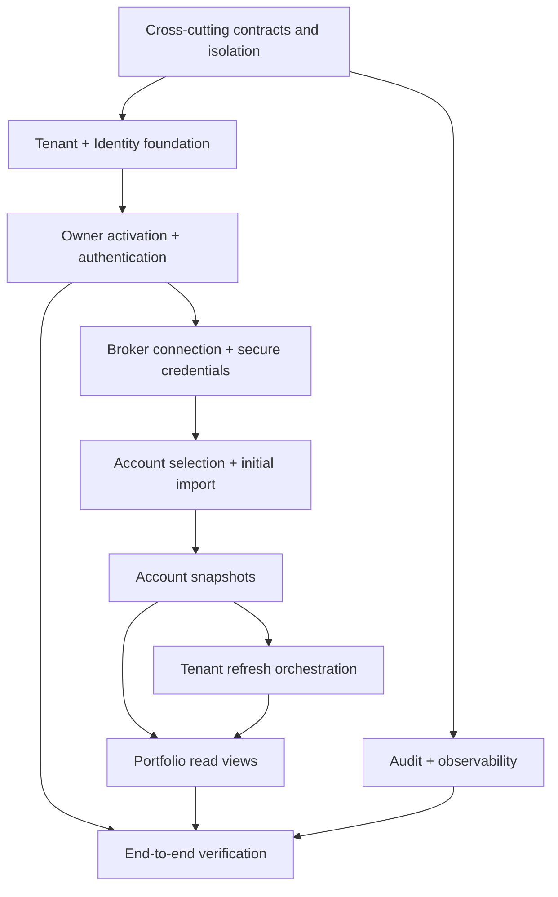

# Slice invariants and dependencies

## Cross-cutting invariants

1. Tenant context originates from trusted authentication context and is
   enforced in every service and by PostgreSQL Row-Level Security.
2. User bearer tokens terminate at HTTP boundaries and never enter RabbitMQ.
3. Cross-service work is at-least-once, idempotent, and uses local outbox/inbox
   records; there are no cross-service database transactions.
4. Broker credentials, activation secrets, access tokens, and private key
   material never appear in logs, audit details, error messages, or ordinary
   message fields.
5. At most one tenant-level refresh is unfinished for a tenant, and at most one
   broker fetch is in flight for an account.
6. A failed import never destroys the last successful account snapshot.
7. Portfolio reads never present stale, missing, or mixed-time data as uniformly
   current.
8. Operational numeric policy values such as expiry, retry, timeout, concurrency,
   freshness, and retention limits are configuration with validation and safe
   defaults, not immutable hardcoded values.
9. Stable machine-readable error codes are separate from user-friendly messages
   and internal diagnostic details.
10. The slice is a local-development system and is not approved for production
    or public-internet exposure.

## Dependency map

## Readiness summary

Architecture readiness requires resolved ownership, lifecycle, failure,
security, consistency, and observability contracts at the level defined by this
bundle. Functional readiness requires the real local end-to-end outcome stated
above. Detailed gates are in
[Implementation and readiness](implementation-and-readiness/index.md).

[Back to index](index.md)
