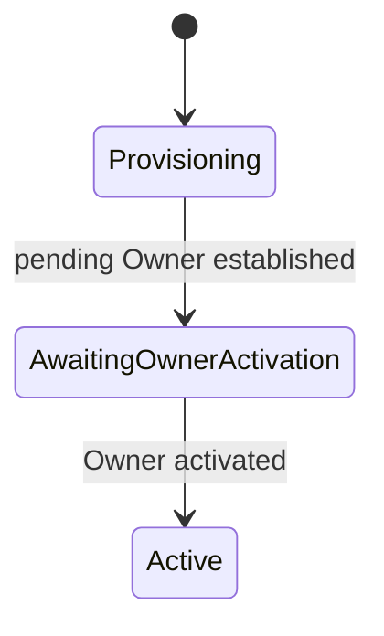
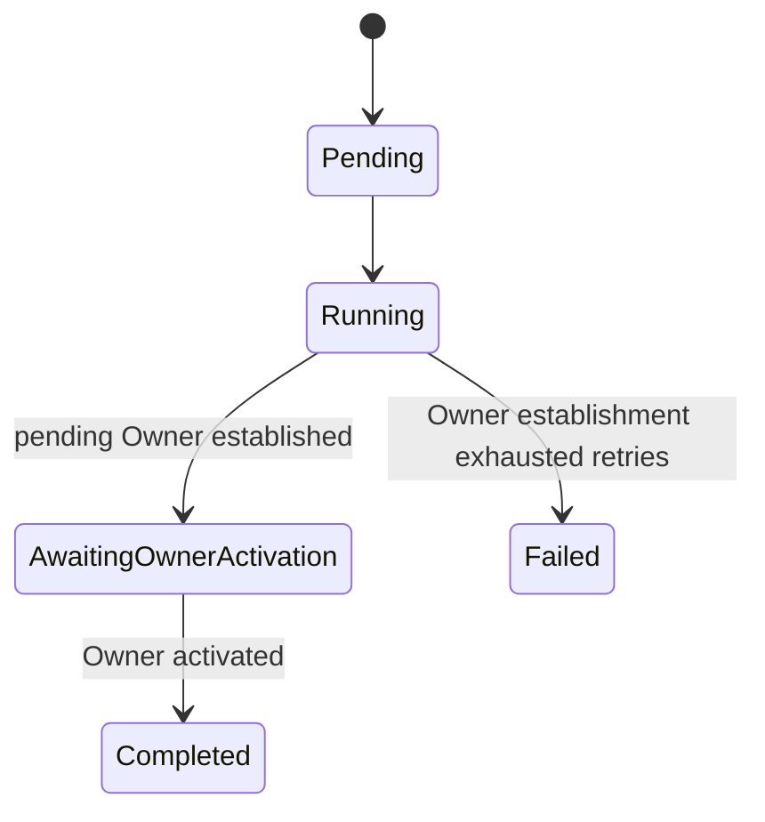
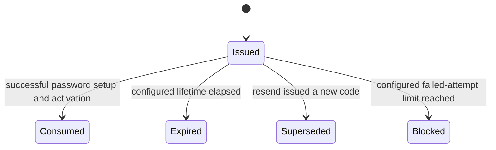

# Onboarding and access

## Provisioning outcome

An operator uses the protected Admin CLI to request a tenant and initial Owner.
Tenant Service commits the tenant, provisioning operation, audit record, and
outbox work locally, then returns `provisioningOperationId`. The CLI observes
later stages rather than waiting for Identity or SMTP.

Tenant lifecycle:

Provisioning operation lifecycle is separate:

The invariant "a tenant always has an active Owner" applies once a tenant is
`Active`. A tenant may legitimately have only a pending Owner during provisioning.
Failure to establish that Owner leaves the tenant in `Provisioning` and the
operation `Failed`; an authorized operator may safely retry without creating a
duplicate tenant or Owner.

Email delivery failure does not roll back the tenant or pending Owner. Delivery
retries and resend remain observable while the tenant stays
`AwaitingOwnerActivation`.

## Activation policy

Identity Service owns the one-time activation code and enforces:

- configurable expiry;
- configurable maximum verification attempts;
- storage of only an irreversible code hash;
- single use;
- issuance of a new code on resend and immediate invalidation of the prior code;
- atomic password setup, Owner activation, membership activation, and code
  consumption;
- a safe neutral result for reuse of an already consumed or otherwise invalid
  code;
- no code values in logs, audit records, user-facing errors, or delivery history.

Conceptual activation challenge lifecycle:

Email delivery is separately observable as pending/delivering, delivered, or
terminally failed. Delivery state never determines whether a code is valid or
whether the Owner is active.

Email Service owns message composition and delivery state. The code is encrypted
for Email Service in the asynchronous delivery command as specified in
[Security, audit, and observability](security-audit-observability.md).

## Authentication and token policy

- Identity Service uses ASP.NET Core Identity and OpenIddict.
- Access JWT lifetime is configurable and deliberately short.
- Refresh tokens are longer-lived, rotated on use, and revocable by Identity
  Service.
- Blocking a user or tenant, or changing a membership/role, prevents issuance
  and refresh of tokens immediately.
- An already issued access JWT remains valid until its short expiry; distributed
  immediate access-token revocation is not part of the slice.
- Each HTTP API validates signature, issuer, audience, lifetime, permissions,
  and tenant/resource attributes locally.
- User bearer tokens terminate at HTTP boundaries and never enter RabbitMQ.
- Async service commands use narrowly scoped internal JWTs issued by Identity
  Service for the recipient and action.

## Permissions and roles

Authorization checks effective permissions plus tenant/resource attributes. No
service should contain business authorization of the form `role == Owner`.

Conceptual permissions include:

- read portfolio and freshness;
- request portfolio refresh;
- read broker connections/accounts;
- manage broker connections and account inclusion;
- manage tenant;
- manage tenant memberships.

Exact permission names are a contract-design detail, but their meanings must be
stable and independently testable.

Roles are fixed bundles for the first slice:

| Capability | Owner | Manager | Viewer |
| --- | ---: | ---: | ---: |
| Read both portfolio views, freshness, coverage, and refresh state | Yes | Yes | Yes |
| Request manual refresh | Yes | Yes | No |
| Read safe connection/account state | Yes | As permitted by the read bundle; no secrets | As permitted by the read bundle; no secrets |
| Create, update credentials for, select accounts from, or disconnect a broker connection | Yes | No | No |
| Manage tenant lifecycle and users | Yes | No | No |

The final permission catalogue must make any read-only connection visibility
explicit; no role can ever read credential values.

There are no custom roles, direct per-user grants, or per-user denies in this
slice. Identity Service centrally defines the fixed role-to-permission mapping
and places effective permissions in JWT claims.

## Slice boundary for Manager and Viewer

The slice implements and tests Owner, Manager, and Viewer permissions, but only
the initial Owner has an end-to-end onboarding flow. Invitations and user-facing
membership creation are deferred. Manager and Viewer authorization is verified
through prepared integration-test memberships rather than a new product flow.

## Access failures

Authentication failures use neutral responses and stable service-owned error
codes. User-facing messages come from the Identity Service message catalogue;
raw Identity/OpenIddict exceptions are not exposed.

Rate limiting for login, activation verification, and resend is intentionally
deferred from this slice but remains required for the complete MVP. This is
acceptable only because the slice and MVP are local-development systems without
public-internet exposure. Any change to that deployment boundary makes public
endpoint protection a blocking prerequisite.
