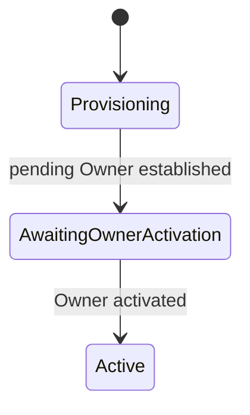
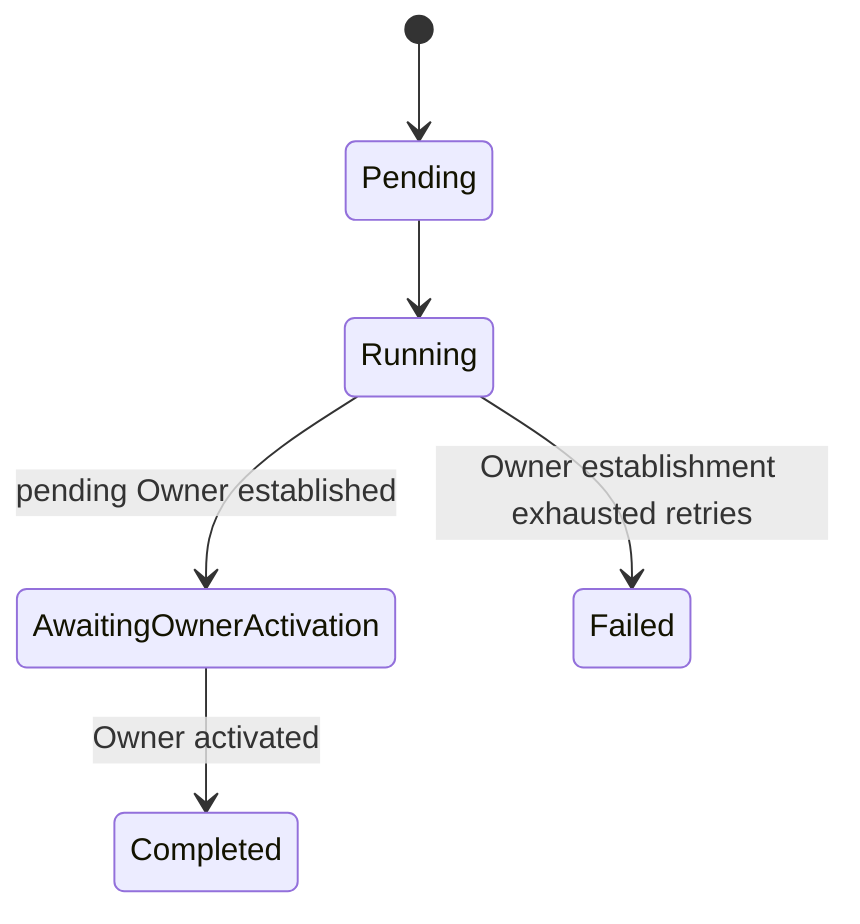
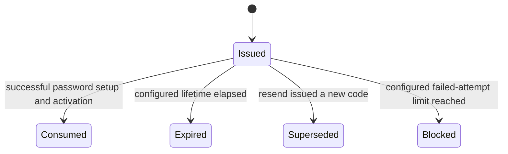

# Provisioning and activation

## Provisioning outcome

An operator uses the protected Admin CLI to request a tenant and initial Owner.
Tenant Service commits the tenant, provisioning operation, audit record, and
outbox work locally, then returns `provisioningOperationId`. The CLI observes
later stages rather than waiting for Identity or SMTP.

Tenant lifecycle:

Provisioning operation lifecycle is separate:

The invariant "a tenant always has an active Owner" applies once a tenant is
`Active`. A tenant may legitimately have only a pending Owner during provisioning.
Failure to establish that Owner leaves the tenant in `Provisioning` and the
operation `Failed`; an authorized operator may safely retry without creating a
duplicate tenant or Owner.

Email delivery failure does not roll back the tenant or pending Owner. Delivery
retries and resend remain observable while the tenant stays
`AwaitingOwnerActivation`.

## Activation policy

Identity Service owns the one-time activation code and enforces:

- configurable expiry;
- configurable maximum verification attempts;
- storage of only an irreversible code hash;
- single use;
- issuance of a new code on resend and immediate invalidation of the prior code;
- atomic password setup, Owner activation, membership activation, and code
  consumption;
- a safe neutral result for reuse of an already consumed or otherwise invalid
  code;
- no code values in logs, audit records, user-facing errors, or delivery history.

Conceptual activation challenge lifecycle:

Email delivery is separately observable as pending/delivering, delivered, or
terminally failed. Delivery state never determines whether a code is valid or
whether the Owner is active.

Email Service owns message composition and delivery state. The code is encrypted
for Email Service in the asynchronous delivery command as specified in
[Security, audit, and observability](../security-audit-observability/index.md).

[Back to index](index.md)
