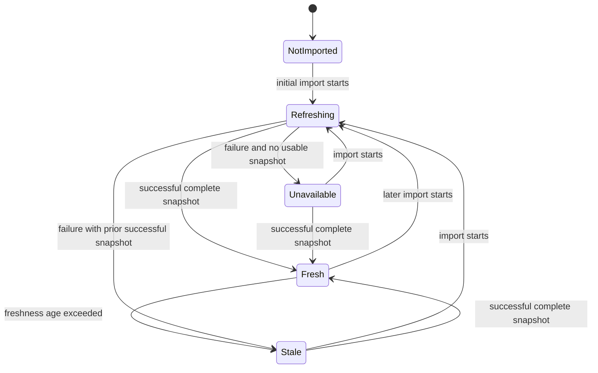
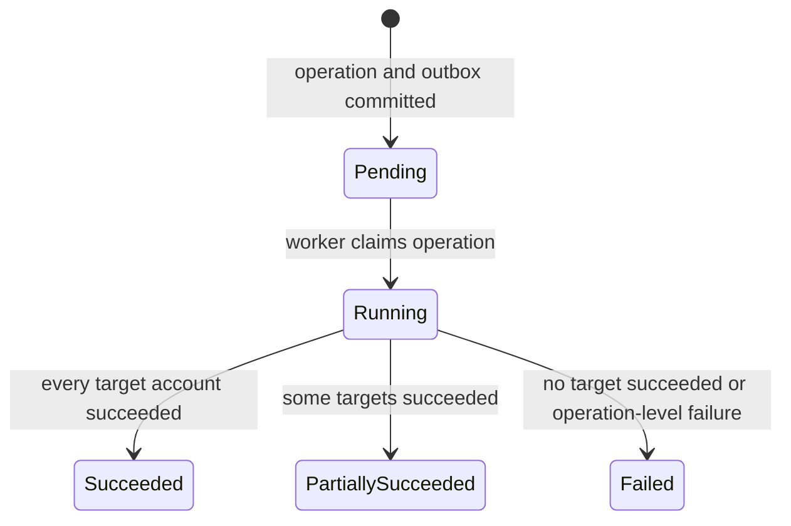

# Portfolio refresh and views

## Position data status

Each included account has an independently derived data status:

- `NotImported`: no import has yet reached a terminal outcome.
- `Refreshing`: a fetch for the account is currently in flight.
- `Fresh`: the latest complete successful snapshot is within the configured
  freshness policy and no later failed attempt has invalidated currentness.
- `Stale`: a prior successful snapshot is still usable but either aged beyond
  the configured threshold or a newer import attempt failed.
- `Unavailable`: no usable successful snapshot exists.

A failed import never deletes or partially overwrites the last successful
snapshot. A successful complete response containing zero positions is a valid
empty snapshot.

`Refreshing` is a transient activity overlay, not a loss of information about
the prior snapshot. While a fetch runs, the API exposes both that activity and
the prior snapshot's `Fresh`, `Stale`, or absent/unavailable quality. Portfolio
availability is calculated from committed snapshot quality, not from the mere
fact that refresh is in progress.

## Tenant refresh lifecycle

Manual refresh is an asynchronous tenant-level operation:

Timeout, provider unavailability, credential rejection, key-provider failure,
and other causes are represented by a list of stable structured errors, not by
additional top-level states.

Each error identifies an account or the operation as a whole, a stable code,
safe parameters, occurrence time, and whether the condition is retryable or
requires action. Multiple errors may be retained for multiple attempts.

## Acceptance and target-set policy

The HTTP request is accepted synchronously by Portfolio Service:

1. validate permission and tenant/resource context;
2. reject with a stable `no included accounts` error when no account has
   `included = true`;
3. atomically find an unfinished tenant refresh or create a new `Pending`
   operation;
4. when creating, capture the target account set and persist audit/outbox work;
5. return the known operation identifier and whether it was newly created or
   reused.

The captured set does not change while the operation runs. An account included
after acceptance receives its own automatic initial import and joins the next
tenant refresh. An account excluded during refresh may finish an already started
fetch, but its snapshot no longer participates in current portfolio views.

## Concurrency and repeat policy

- At most one unfinished tenant-level refresh exists per tenant.
- The invariant is enforced through Portfolio Service's shared authoritative
  PostgreSQL state, not an in-memory lock, so it holds across service instances.
- Simultaneous requests atomically create-or-find the same operation and receive
  the same `operationId`.
- Requests received while the operation is `Pending` or `Running` return it.
- A request received within a configurable interval after terminal completion
  returns that recent operation rather than starting another.
- A request after that interval creates a new operation.
- The response explicitly says whether the operation was created or reused.
- At most one broker fetch is in flight for an account. Initial import and tenant
  refresh reuse the same in-flight account work rather than call the broker twice.

The configurable recent-operation interval is deliberate product policy, not an
implementation limitation. Clients do not need to supply an idempotency key for
manual refresh in this slice.

## Account execution and retries

- Account fetches are independent; failure of one does not prevent attempts for
  other target accounts.
- Transient network, throttling, and provider-availability failures use
  configurable attempt and backoff policies.
- Errors requiring Owner action are not automatically retried.
- Account work may run concurrently up to a configured limit.
- A worker crash leaves recoverable unfinished work. After a configured lease or
  staleness interval, another worker may safely claim it.
- After configured attempts or the operation deadline are exhausted, the account
  receives a terminal result.
- Overall refresh outcome is calculated only when every captured target has a
  terminal result.

## Transaction and snapshot boundary

There is no transaction spanning all accounts. For each successful account
fetch, Portfolio Service atomically commits:

- one complete immutable or versioned account snapshot;
- the account's latest-success/freshness reference;
- the account result for the import/refresh operation;
- local audit and outbox records required by that transition.

Readers see either the prior complete snapshot or the new complete snapshot,
never a partially written position set. Successful accounts may become visible
while the tenant refresh is still `Running`; therefore a portfolio may temporarily
combine account snapshots from different moments. The response discloses this
through operation state and per-account snapshot times.

## Portfolio availability

| Status | Meaning |
| --- | --- |
| `NotConfigured` | No account currently has `included = true`. |
| `Ready` | Every included account has a `Fresh` successful snapshot. |
| `Degraded` | At least one included account has a usable snapshot and not every included account is `Fresh`; one or all accounts may be stale and others may be unavailable. |
| `Unavailable` | Included accounts exist, but none has a usable successful snapshot. |

At `Degraded`, calculations use only available snapshots and must disclose the
included, represented, stale, and missing account sets. A successful empty
snapshot participates normally and is not confused with missing data.

Freshness is evaluated per account. A successful import starts as `Fresh` and
ages into `Stale` after a configured threshold. A later failed refresh makes the
prior snapshot `Stale` immediately, even if it is younger than the age threshold.

## Required read views

Both views are required in the slice and are derived from the same account
snapshots:

### Account view

Positions remain grouped by broker connection and account. The response includes
account inclusion, data status, snapshot time, refresh participation, and safe
errors without credential details.

### Consolidated view

Positions representing the same reliably identified instrument and currency are
aggregated across included accounts. The response preserves the contributing
account breakdown. A matching display ticker alone is not enough to establish
instrument identity; ambiguous positions remain separate.

Every response includes:

- portfolio availability status;
- response-generation time;
- current refresh operation when one exists;
- included-account coverage;
- per-account snapshot times and data statuses;
- stale/missing disclosures and safe error codes;
- positions for the selected view.

Reading a portfolio never starts refresh automatically.

## Currency policy

- Every position displays the currency reported for that account position.
- The slice does not add monetary values across currencies.
- It does not calculate totals grouped by currency.
- It does not define a base currency or perform FX conversion.
- Positions with different currencies are not combined into one consolidated
  position.

## Read authorization

Owner, Manager, and Viewer may read both views, freshness, coverage, and safe
refresh state. Owner and Manager may request refresh. Viewer cannot request it.
Internal diagnostics, credentials, secret metadata, and unsafe provider errors
are never returned by either view.
