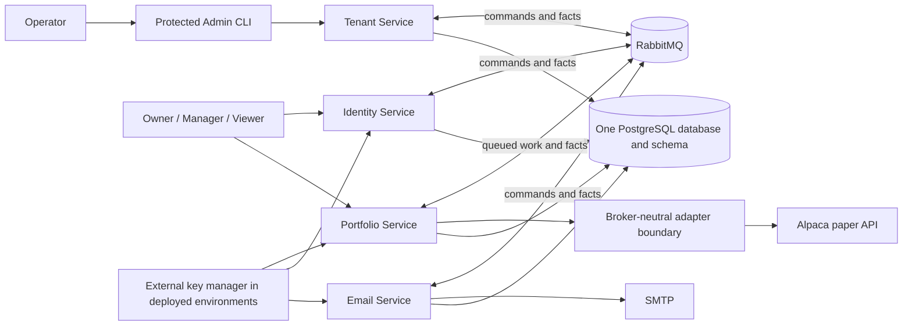

# Slice system context

## System context

The shared PostgreSQL deployment does not imply shared data ownership. Each
service owns its tables, migrations, runtime role, transactions, audit records,
outbox, and inbox. No service reads or joins another service's tables.

Identity, Tenant, Portfolio, and Email are independently deployable processes.
The initial runtime topology remains Docker Compose on one machine, while the
correctness rules do not assume that a service has only one process instance.

[Back to index](index.md)
